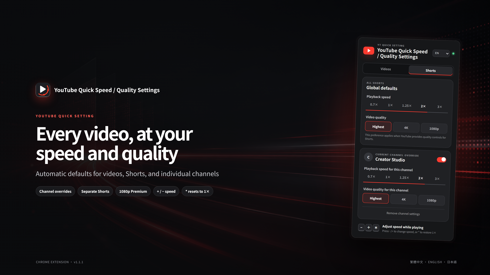
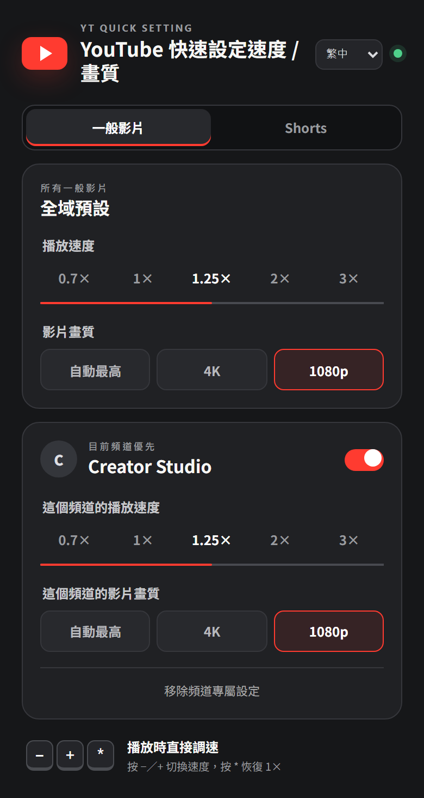
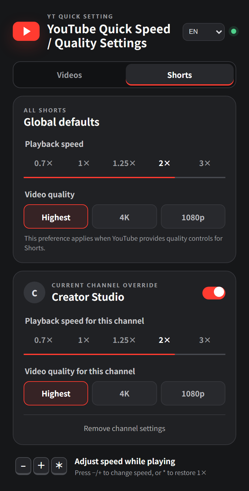
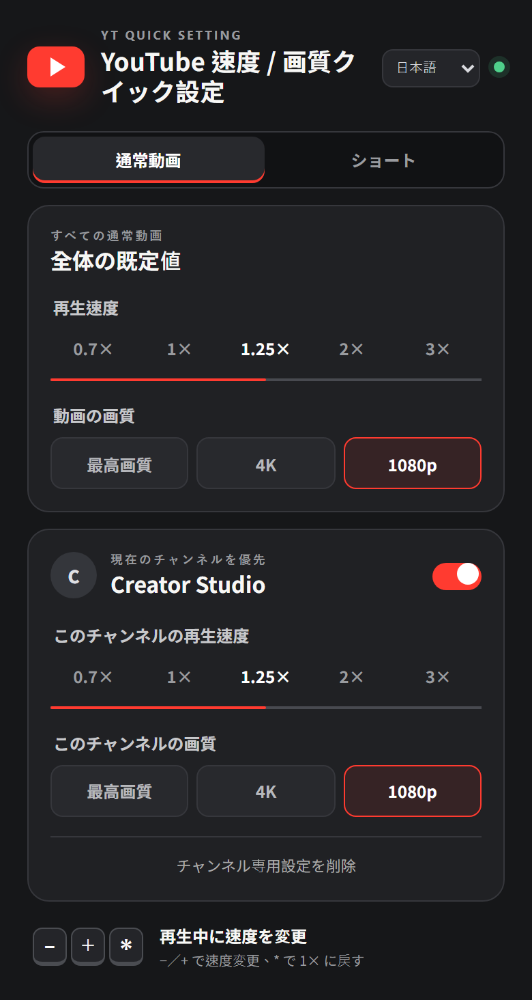

# YouTube Quick Speed / Quality Settings

[繁體中文](README.md) · [English](README.en.md) · [日本語](README.ja.md)



A Chrome extension that automatically applies playback speed, video quality, and channel-specific preferences to standard YouTube videos and Shorts.

## Features

- Playback speeds: `0.7×`, `1×`, `1.25×`, `2×`, and `3×`
- Quality preferences: Highest, 4K, and 1080p
- Falls back to the highest available quality that does not exceed the target
- Prefers `1080p Premium` when it is available
- Separate profiles for standard videos and Shorts
- Channel-specific profiles override the matching global profile
- A two-second player notice shows the active channel speed and quality
- Press `+` or `-` to change speed, and `*` to return immediately to `1×`
- Keeps YouTube's native speed and quality menus in sync whenever the player permits it
- Traditional Chinese, English, and Japanese interfaces, with system or manual language selection
- Settings are stored with `chrome.storage.sync`

## Interface

| Traditional Chinese | English | Japanese |
| --- | --- | --- |
|  |  |  |

## Installation

1. Download this repository, or run:

   ```bash
   git clone https://github.com/ahui3c/Youtube-Quick-Setting.git
   ```

2. Open `chrome://extensions/` in Chrome.
3. Enable **Developer mode**.
4. Select **Load unpacked**.
5. Choose this project folder.
6. Open a YouTube video or Short and click the extension icon to configure it.

After updating the files, click **Reload** for the extension on `chrome://extensions/`, then refresh open YouTube tabs.

## Usage

Use the **Videos / Shorts** selector to configure each content type independently. When the popup is opened from a Short, it automatically selects the Shorts profile.

To create a channel override, open the popup on that channel's video or Short and enable **Current channel override**. Each channel stores independent standard-video and Shorts profiles.

Priority order:

1. Current channel + current content type
2. Global profile for the current content type

### Keyboard shortcuts

| Key | Action |
| --- | --- |
| `+` | Select the next faster speed |
| `-` | Select the next slower speed |
| `*` | Reset the current playback session to `1×` |

Shortcuts are ignored while typing in search, comment, and other text fields.

## Quality behavior

When the requested resolution is unavailable, the extension selects the highest available quality that does not exceed the target. If every available option is above the target, it selects the nearest higher option.

`1080p Premium` requires both an eligible video and an account for which YouTube offers the option. Standard 1080p is used otherwise.

The current desktop Shorts player does not expose a native quality menu or a usable quality API. The extension stores the Shorts quality preference independently and applies it whenever YouTube exposes a controllable option. Shorts playback-speed control is unaffected.

## Privacy

- No personal data is collected, transmitted, or sold.
- No external analytics are used.
- The extension runs only on `youtube.com`.
- Preferences stay in Chrome sync storage.

## Development

The project uses Chrome Manifest V3. Tests under `tests/` cover quality fallback, legacy-setting migration, keyboard behavior, and localized popup rendering. Run `npm install`, `npx playwright install chromium`, and `npm test` to execute the complete suite.

The 4K Traditional Chinese, English, and Japanese promotional assets are available under `docs/images/`.
