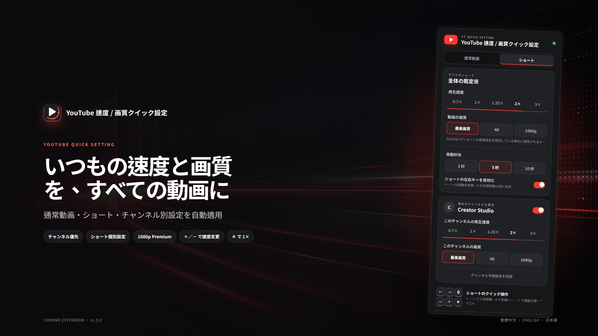

# YouTube 速度 / 画質クイック設定

[繁體中文](README.md) · [English](README.en.md) · [日本語](README.ja.md)



YouTube の通常動画とショートに、再生速度・画質・チャンネル別設定を自動適用する Chrome 拡張機能です。

## 主な機能

- 再生速度：`0.7×`、`1×`、`1.25×`、`2×`、`3×`
- 画質設定：最高画質、4K、1080p
- 指定画質がない場合、目標以下で利用できる最高画質を選択
- 「Premium 高画質を使用」は既定でオフの独立した設定で、オンの場合のみ `1080p Premium` を許可
- 通常動画とショートを個別に設定
- YouTube ホームのショートカードにクリック可能なチャンネル名を追加
- チャンネル専用設定は同じ動画タイプの全体設定より優先
- 通常動画ではシアターモードを自動的に有効化でき、チャンネルごとに全体設定に従う／常にオン／常にオフを選択可能
- チャンネル設定の適用時、プレーヤー右下に速度と画質を2秒間表示
- `+`／`-` で速度変更、`*` で即座に `1×` へ戻す
- `C` キーまたはパネルのボタンで、現在の動画タイトルと整理された URL をクリップボードへコピー
- プレーヤーが許可する場合、YouTube 標準の速度・画質メニューにも同期
- 同じ動画・画質設定の適用を1回にまとめ、冒頭の繰り返し読み込みを防止
- 繁体字中国語、英語、日本語に対応し、システム連動または手動選択が可能
- 設定は `chrome.storage.sync` に保存

## 操作画面

| 繁体字中国語 | English | 日本語 |
| --- | --- | --- |
|  |  |  |

## インストール

1. このリポジトリをダウンロードするか、次を実行します。

   ```bash
   git clone https://github.com/ahui3c/Youtube-Quick-Setting.git
   ```

2. Chrome で `chrome://extensions/` を開きます。
3. **デベロッパーモード**を有効にします。
4. **パッケージ化されていない拡張機能を読み込む**を選択します。
5. このプロジェクトフォルダーを指定します。
6. YouTube 動画またはショートを開き、拡張機能アイコンから設定します。

ファイルを更新した後は、`chrome://extensions/` で拡張機能を再読み込みし、YouTube のタブも更新してください。

## 使い方

**通常動画／ショート**の切り替えで、それぞれの設定を編集できます。ショートのページからパネルを開くと、自動的にショート設定が選択されます。

「ホームのショートにチャンネル名を表示」は既定でオンです。現在表示されているカードについてのみ YouTube から公開チャンネル情報を取得し、タイトルの下にクリック可能なチャンネル名を追加します。結果は現在のページ内でキャッシュされ、第三者サーバーには送信されません。

チャンネル別に設定する場合は、そのチャンネルの動画またはショートでパネルを開き、**現在のチャンネルを優先**を有効にします。通常動画とショートの設定は別々に保存されます。

### シアターモード

「通常動画」で「シアターモードを自動的に有効化」をオンにすると、動画を開いたときに YouTube 標準のシアターモード操作で自動切り替えします。適用は動画の読み込みごとに1回だけで、その後に手動でシアターモードを解除しても再度強制しません。チャンネル設定では「全体設定に従う」「常にオン」「常にオフ」を選択できます。ショートでは表示されません。

適用優先順位：

1. 現在のチャンネル＋現在の動画タイプ
2. 現在の動画タイプの全体設定

### キーボードショートカット

| キー | 動作 |
| --- | --- |
| `+` | 次の速い再生速度を選択 |
| `-` | 次の遅い再生速度を選択 |
| `*` | 現在の再生を `1×` に戻す |
| `C` | 現在の動画タイトルと URL をコピーし、結果を画面表示 |
| `←`／`→` | ショートを 5 秒戻す／進める |
| `0` | ショートの先頭に戻る |

検索欄、コメント欄などへの文字入力中はショートカットを使用しません。
ショート設定では左右キーを無効にしたり、移動秒数を `3`、`5`（既定）、`10` 秒から選択できます。左右キーを無効にしても `0` の先頭移動は使用できます。
YouTube 標準では `C` キーが字幕の切り替えに使われます。本拡張機能の導入後は、動画ページで単独の `C` キーを押すとコピー操作が優先されます。字幕はプレーヤーの CC ボタンから切り替えられます。

## 画質の動作

指定した解像度がない場合、目標以下で利用可能な最高画質を選択します。すべての画質が目標より高い場合は、最も近い高画質を選択します。

最高画質、4K、1080p の3項目は、既定では Premium 画質を除外します。ユーザーが「Premium 高画質を使用」を明示的にオンにした場合のみ `1080p Premium` が候補になります。未登録の場合は、体験案内を避けるためオフのまま使用してください。チャンネル設定ではこのスイッチも個別に保存します。

現在のデスクトップ版ショートには、標準の画質メニューや利用可能な画質 API がありません。ショートの画質設定は個別に保存し、YouTube が操作可能な項目を提供した場合に適用します。ショートの再生速度変更には影響しません。

## プライバシー

- 個人データを収集、送信、販売しません。
- 外部アクセス解析を使用しません。
- `youtube.com` 上でのみ動作します。
- 設定は Chrome の同期ストレージだけに保存します。

詳細は [プライバシーポリシー](PRIVACY.md) をご覧ください。

## 開発

Chrome Manifest V3 を使用しています。`tests/` には、画質フォールバック、旧設定の移行、キーボード操作、多言語パネル表示のテストがあります。`npm install`、`npx playwright install chromium`、`npm test` の順に実行すると、すべてのテストを確認できます。

繁体字中国語、英語、日本語の 4K プロモーション素材は `docs/images/` に収録しています。
