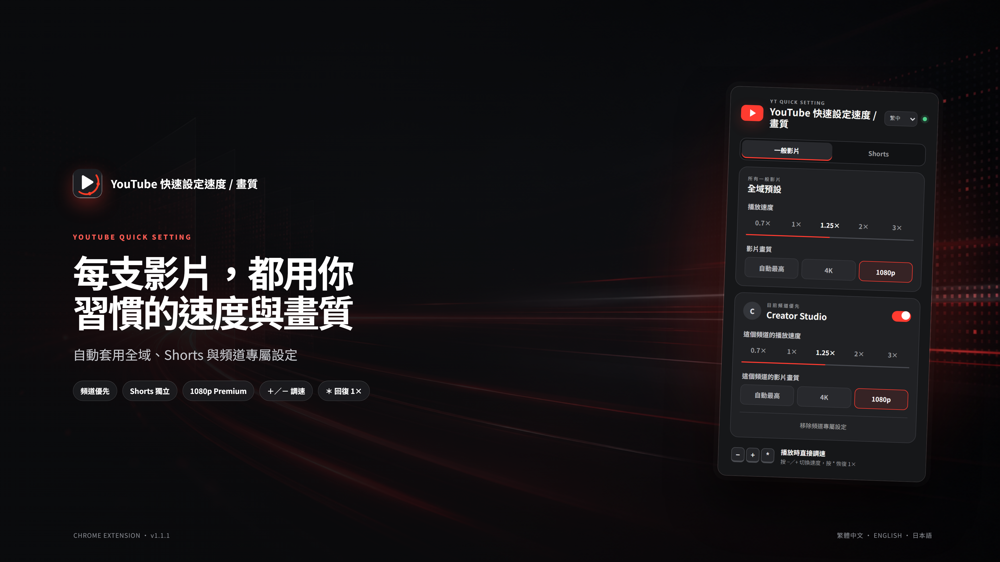

# YouTube 快速設定速度 / 畫質

[繁體中文](README.md) · [English](README.en.md) · [日本語](README.ja.md)



自動為 YouTube 一般影片與 Shorts 套用播放速度、畫質與頻道專屬設定的 Chrome 擴充功能。

## 主要功能

- 播放速度：`0.7×`、`1×`、`1.25×`、`2×`、`3×`
- 畫質偏好：自動最高、4K、1080p
- 指定畫質不存在時，選擇不超過目標的最高可用畫質
- 選擇 1080p 時，優先使用可用的 `1080p Premium`
- 一般影片與 Shorts 使用獨立設定
- 可為個別頻道建立專屬設定，優先於同類型的全域設定
- 頻道設定生效時，在播放器右下角顯示兩秒提示
- `+`／`-` 直接調整播放速度，`*` 立即恢復 `1×`
- 播放速度與畫質會盡可能同步至 YouTube 原生設定面板
- 支援繁體中文、英文、日文，可跟隨系統或手動選擇
- 設定透過 `chrome.storage.sync` 在 Chrome 中同步保存

## 操作畫面

| 繁體中文 | English | 日本語 |
| --- | --- | --- |
|  |  |  |

## 安裝

1. 下載此專案，或執行：

   ```bash
   git clone https://github.com/ahui3c/Youtube-Quick-Setting.git
   ```

2. 在 Chrome 開啟 `chrome://extensions/`。
3. 開啟右上角「開發人員模式」。
4. 選擇「載入未封裝項目」。
5. 選取本專案資料夾。
6. 開啟 YouTube 影片或 Shorts，點擊工具列上的擴充功能圖示完成設定。

更新程式後，請在 `chrome://extensions/` 對擴充功能按一次「重新載入」，並重新整理 YouTube 分頁。

## 使用方式

### 一般影片與 Shorts

在面板上切換「一般影片」或「Shorts」，分別設定播放速度與畫質。從 Shorts 頁面開啟面板時會自動選取 Shorts。

### 頻道專屬設定

在該頻道的影片或 Shorts 頁面開啟面板，啟用「目前頻道優先」。每個頻道都會分別保存一般影片與 Shorts 設定。

套用優先順序：

1. 目前頻道＋目前影片類型
2. 目前影片類型的全域設定

### 快捷鍵

| 按鍵 | 功能 |
| --- | --- |
| `+` | 切換到下一個較快速度 |
| `-` | 切換到下一個較慢速度 |
| `*` | 將本次播放恢復為 `1×` |

在搜尋框、留言框或其他文字輸入區域輸入時，不會攔截這些按鍵。

## 畫質行為

如果影片沒有指定解析度，擴充功能會選擇不超過目標的最高畫質。例如設定 4K、影片最高只有 1440p 時，會選擇 1440p。如果所有可用畫質都高於目標，則選擇最接近的較高畫質。

`1080p Premium` 只有在 YouTube Premium 帳號與影片本身都提供該選項時可用；否則使用標準 1080p。

目前桌面版 YouTube Shorts 沒有原生畫質選單或可用的畫質控制 API。擴充功能會獨立保存 Shorts 畫質偏好，並在 YouTube 提供可控制選項時套用；Shorts 播放速度不受此限制。

## 隱私

- 不收集、傳送或販售個人資料。
- 不使用外部分析服務。
- 僅在 `youtube.com` 執行。
- 設定只保存在 Chrome 同步儲存空間。

## 開發與測試

此專案使用 Chrome Manifest V3，主要檔案如下：

- `popup.html`／`popup.js`／`popup.css`：設定介面與多語系
- `content.js`：YouTube 導航、頻道偵測、快捷鍵與提示
- `page-bridge.js`：同步 YouTube 播放器狀態與原生設定面板
- `_locales/`：Chrome 擴充功能名稱與說明的系統語言版本
- `tests/`：畫質選擇、設定遷移、快捷鍵與介面渲染測試

安裝開發相依套件並執行全部測試：

```powershell
npm install
npx playwright install chromium
npm test
```

## 宣傳素材

可直接使用的 4K 圖片位於 `docs/images/`：

- `promo-zh-4k.png`：繁體中文，3840×2160
- `promo-en-4k.png`：英文，3840×2160
- `promo-ja-4k.png`：日文，3840×2160

宣傳背景由 OpenAI image generation 產生，最終文字、圖示與插件畫面以專案真實介面程式化排版，避免出現錯字或虛構操作畫面。
